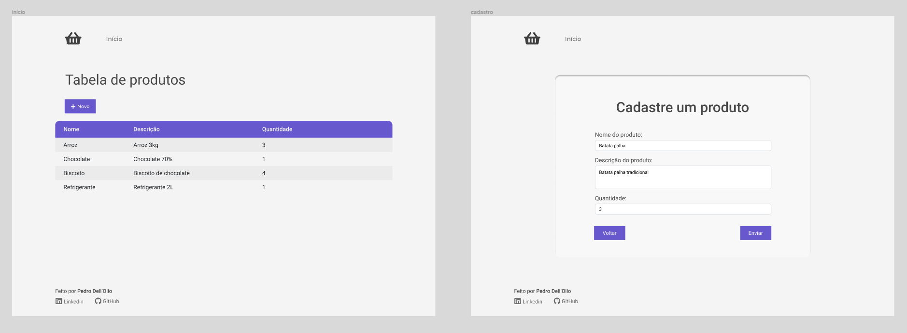
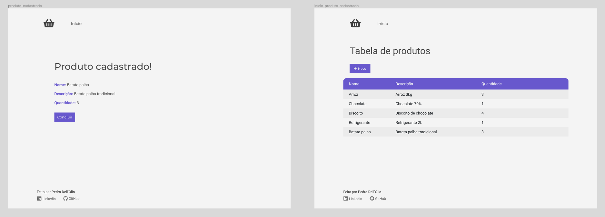

<h1 align="center">Lista de Compras</h1>

Um projeto em <strong>Java</strong> e <strong>Spring</strong>. <a href="https://spring-lista-mercado.herokuapp.com/">Clique aqui</a> para acessar o deploy no <strong>Heroku</strong>.

 <a href="#sobre">Sobre</a> •
 <a href="#tecnologias">Tecnologias</a> • 
 <a href="#como-funciona">Como Funciona</a> • 
 <a href="#protótipo">Protótipo</a> • 
 <a href="#autor">Autor</a>

## Sobre
O projeto tem como finalidade desenvolver na prática conceitos de **Java** para **desenvolvimento web**, além de explorar o **padrão de projeto MVC**. A aplicação foi feita com o framework **Spring**: o **Spring Boot** para configuração da aplicação e o **Spring Data** para conexão com o banco de dados **PostgreSQL**. 

O site permite o cadastramento de produtos, digitalizando a famosa lista de compras que fazemos escrita em um pedaço de papel.

## Tecnologias
As seguintes ferramentas foram usadas no projeto:
* Linguagens
  - **Java**
  - **HTML e CSS**
* Frameworks
  - **Spring Boot**
  - **Spring Data**
* Banco de Dados
  - **PostgreSQL**
* Utilitários
  - **Figma**
  - **Heroku**

## Como funciona
O site possui uma tabela na qual você pode cadastrar produtos com **nome**, **descrição** e **quantidade** através de um formulário. Ao confirmar o cadastro do produto, aparecerá uma tela exibindo as informações que você inseriu.

## Protótipo
[Clique aqui](https://www.figma.com/proto/vgEl4xyZpUSEHNQv60xMhx/spring-lista-mercado?node-id=13%3A3&scaling=scale-down&page-id=0%3A1) para visualizar o layout no **Figma**.

  

  

## Autor
Feito por [Pedro Dell'Olio](https://github.com/pedrodellolio).
Entre em contato pelo [Linkedin](https://www.linkedin.com/in/pedrodellolio/).
